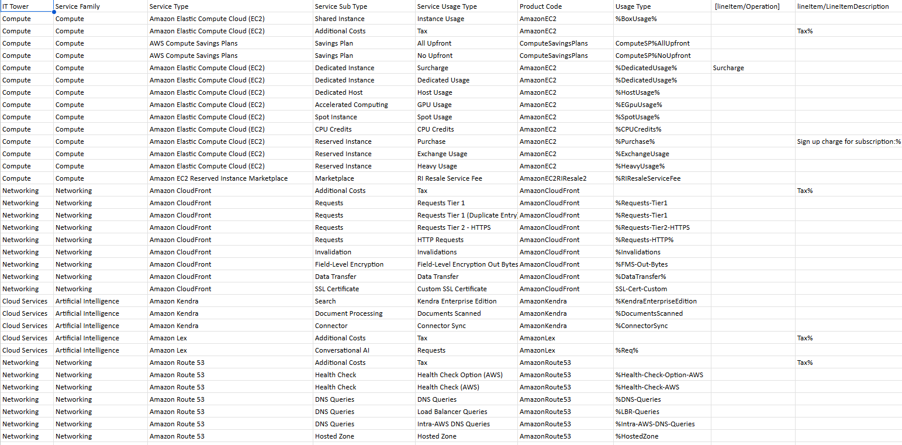

# Лабораторная работа №1. Классификация облачных сервисов AWS

## Цель работы
Изучение основных принципов классификации облачных сервисов на примере Amazon Web Services. Формирование навыков анализа биллинговой информации и распределения сервисов по уровням абстракции.

## Теоретическая часть

### Типы облачных сервисов
**Облачные сервисы** делятся на три основных типа:
* **IaaS** (Infrastructure as a Service) — инфраструктура как услуга
* **PaaS** (Platform as a Service) — платформа как услуга
* **SaaS** (Software as a Service) — программное обеспечение как услуга

## Практическая часть

### Исходные данные
Для анализа используется файл биллинга в формате CSV с данными об использовании сервисов AWS.

### Порядок выполнения работы

#### Импорт данных
1. Открыть Excel
2. Перейти на вкладку **Данные**
3. Выбрать **Из текстового/csv файла**
4. Указать разделитель — точка с запятой

#### Классификация сервисов
На основе предоставленных данных формируем таблицу соответствия:

### Анализ данных
Распределение сервисов по иерархии:

* **Вычислительные ресурсы** (Compute)
  * AmazonEC2
    * BoxUsage
    * DedicatedUsage
    * HostUsage
    * EGPUUsage
    * SpotUsage
    * CPUCredits
  * ComputeSavingsPlans
    * AllUpfront
    * NoUpfront

* **Сетевые сервисы** (Network)
  * AmazonCloudFront
    * Requests (Tier1, Tier2-HTTPS, HTTP)
    * Invalidations
    * DataTransfer
    * FMS-Out-Bytes

* **Искусственный интеллект** (AI/ML)
  * AmazonKendra
    * DocumentsScanned
    * ConnectorSync

* **Доменные сервисы** (Networking)
  * AmazonRoute53
    * DNS-Queries
    * Health-Check
    * Traffic-Flow-Policy-Records
    * Geo-Queries
## Выводы
В ходе выполнения лабораторной работы:
* Изучены основные типы облачных сервисов AWS
* Проведен анализ биллинговой информации
* Сформирована иерархия сервисов по уровням абстракции
* Определены основные категории потребления ресурсов
